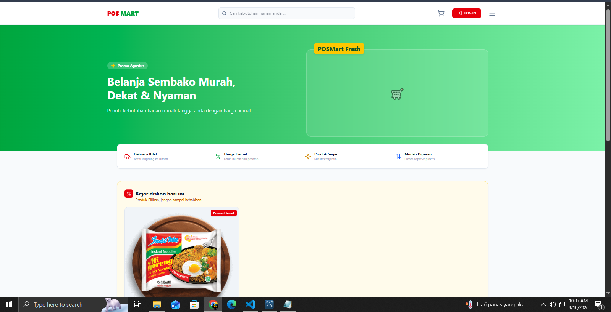
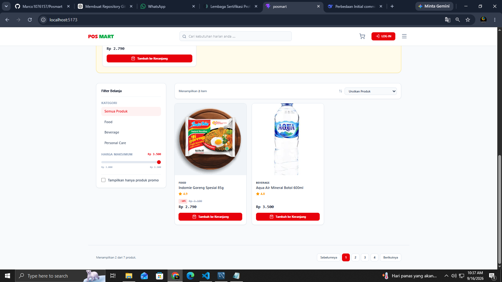
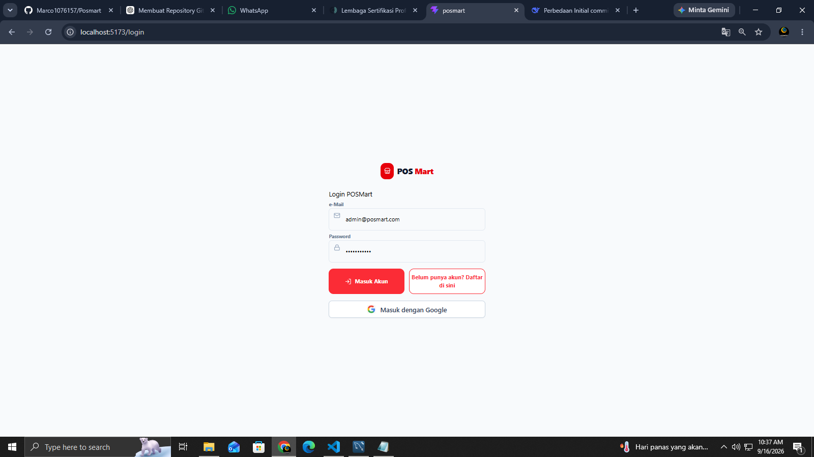
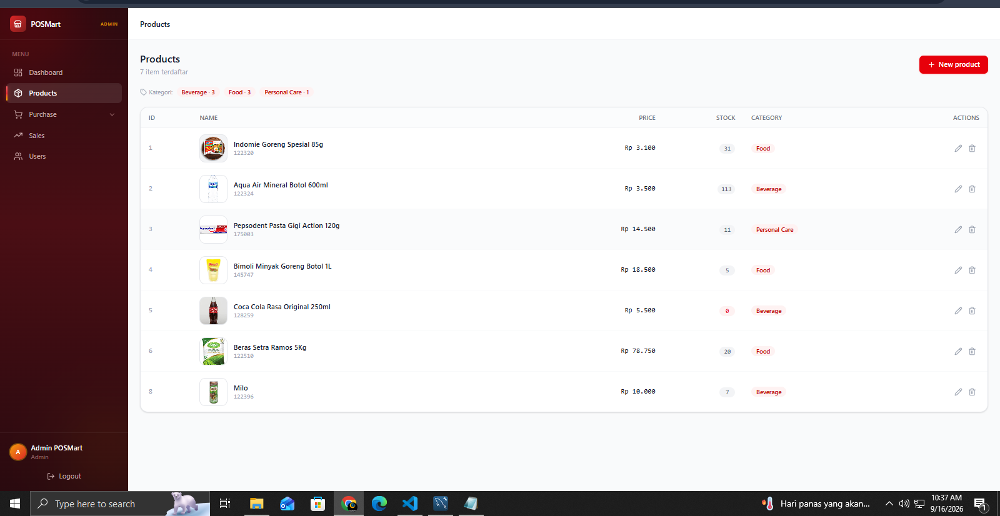

# POSMart

POSMart adalah aplikasi point of sale (POS) dan katalog belanja sederhana. Pelanggan dapat melihat produk, memasukkan produk ke keranjang, lalu checkout. Admin dapat mengelola produk dan pengguna serta melihat ringkasan penjualan.

## Fitur

- Katalog produk dengan pencarian, kategori, filter promo, pengurutan harga, dan pagination.
- Registrasi, login email/password, autentikasi Google OAuth, dan JWT.
- Keranjang belanja, pilihan pengiriman, checkout, serta validasi dan pengurangan stok dalam transaksi database.
- Pengiriman ringkasan pesanan ke WhatsApp setelah checkout.
- Invoice pesanan yang dapat dicetak dan QR code invoice.
- Dashboard admin untuk mengelola produk dan pengguna, serta melihat data penjualan.

> Menu Purchase, Supplier, dan Purchase Order saat ini masih berupa tampilan frontend; belum terhubung ke API/database.

## Teknologi yang digunakan

| Bagian | Teknologi |
| --- | --- |
| Frontend | React 19, Vite 8, Tailwind CSS 4 |
| HTTP client | Axios |
| Grafik dan ikon | Chart.js, react-chartjs-2, Lucide React |
| Backend | PHP native (REST-style endpoint) |
| Database | MySQL dengan PDO (`pdo_mysql`) |
| Autentikasi | JWT custom dan Google OAuth |

## Prasyarat

Pastikan perangkat sudah memasang:

- Node.js `^20.19.0` atau `>=22.12.0` (sesuai kebutuhan Vite 8) dan npm.
- PHP `>= 8.0`; PHP 8.1+ direkomendasikan. Pastikan ekstensi `pdo_mysql` aktif. Ekstensi `curl` juga diperlukan bila memakai login Google.
- MySQL 8+ atau MariaDB yang kompatibel, dalam kondisi berjalan.

Periksa versi bila perlu:

```bash
node -v
npm -v
php -v
php -m
```

Backend saat ini tidak memiliki package Composer tambahan (`backend/composer.json` tidak mendeklarasikan dependency), jadi `composer install` tidak diperlukan untuk menjalankan aplikasi.

## Instalasi dan konfigurasi

1. Clone repository lalu masuk ke folder proyek.

   ```bash
   git clone https://github.com/USERNAME/posmart.git
   cd posmart
   ```

2. Instal dependency frontend.

   ```bash
   npm install
   ```

   Untuk instalasi yang identik dengan `package-lock.json`, gunakan `npm ci` sebagai pengganti `npm install`.

3. Buat konfigurasi backend lokal dari template.

   PowerShell:

   ```powershell
   Copy-Item backend/config/env.example.php backend/config/env.php
   ```

   CMD:

   ```bat
   copy backend\config\env.example.php backend\config\env.php
   ```

4. Buka `backend/config/env.php`, lalu sesuaikan bagian `database` dengan MySQL lokal Anda.

   ```php
   'database' => [
       'host' => 'localhost',
       'user' => 'root',
       'password' => 'password_mysql_anda',
       'name' => 'db_posmart',
   ],
   ```

   Isi juga `jwt_secret` dengan string acak yang panjang. Bagian `google` hanya wajib diisi jika ingin memakai tombol login Google.

5. Jalankan inisialisasi database dari folder root proyek.

   ```bash
   php backend/config/db_init.php
   ```

   Perintah ini membuat database `db_posmart` (atau nama yang Anda atur), tabel `users`, `products`, `orders`, dan `order_items`, kemudian mengisi data contoh produk dan pengguna.

   **Peringatan:** `db_init.php` mereset data `products` dan `users`. Jangan jalankan pada database produksi atau database yang datanya ingin dipertahankan.

## Menjalankan aplikasi

Jalankan backend dan frontend pada dua terminal yang berbeda.

1. Terminal 1 — backend PHP:

   ```bash
   cd backend
   php -S 127.0.0.1:8000
   ```

2. Terminal 2 — frontend Vite (dari folder root proyek):

   ```bash
   npm run dev
   ```

3. Buka alamat yang ditampilkan Vite, biasanya [http://localhost:5173](http://localhost:5173).

Konfigurasi Vite sudah meneruskan request frontend dari `/api/*` ke `http://127.0.0.1:8000/*`, sehingga kedua server di atas harus aktif bersamaan.

Jika PowerShell menolak `npm` karena execution policy, gunakan:

```powershell
npm.cmd run dev
```

### Akun contoh

Setelah menjalankan `db_init.php`, akun berikut tersedia untuk pengembangan lokal:

| Role | Email | Password |
| --- | --- | --- |
| Admin | `admin@posmart.com` | `posmart2026` |
| Cashier | `cashier@posmart.com` | `password123` |

Dashboard hanya dapat diakses oleh akun dengan role `admin`. Ganti atau hapus akun contoh tersebut sebelum deployment.

## Perintah tersedia

```bash
npm run dev     # Menjalankan frontend development server
npm run lint    # Memeriksa kualitas kode JavaScript/JSX
npm run build   # Membuat build frontend
npm run preview # Menjalankan preview hasil build
```

## Struktur folder

```text
POSMart/
├── backend/
│   ├── cart/                 # Endpoint checkout/pesanan
│   ├── config/               # Koneksi PDO, CORS, JWT, middleware, inisialisasi DB
│   │   ├── env.example.php   # Template konfigurasi lokal
│   │   └── db_init.php       # Pembuat skema dan data awal database
│   ├── crud/                 # Endpoint CRUD produk
│   ├── products/             # Gambar produk yang diunggah melalui admin
│   └── user/                 # Endpoint autentikasi dan manajemen pengguna
├── public/                   # Aset statis frontend
├── src/
│   ├── components/           # Komponen UI, termasuk dashboard
│   ├── context/              # State global keranjang
│   ├── hooks/                # Custom hooks produk, penjualan, dan keranjang
│   ├── pages/                # Halaman katalog, login, dashboard, checkout sukses
│   └── utils/                # Axios API dan utilitas invoice
├── vite.config.js            # Konfigurasi Vite dan proxy API
├── package.json              # Dependency serta skrip frontend
└── README.md
```

## Screenshot







